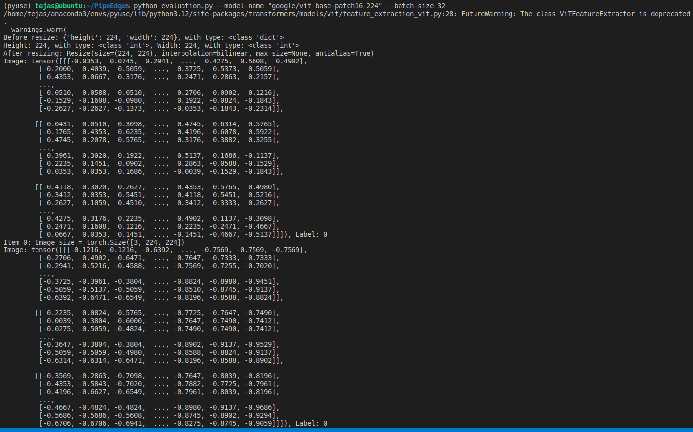
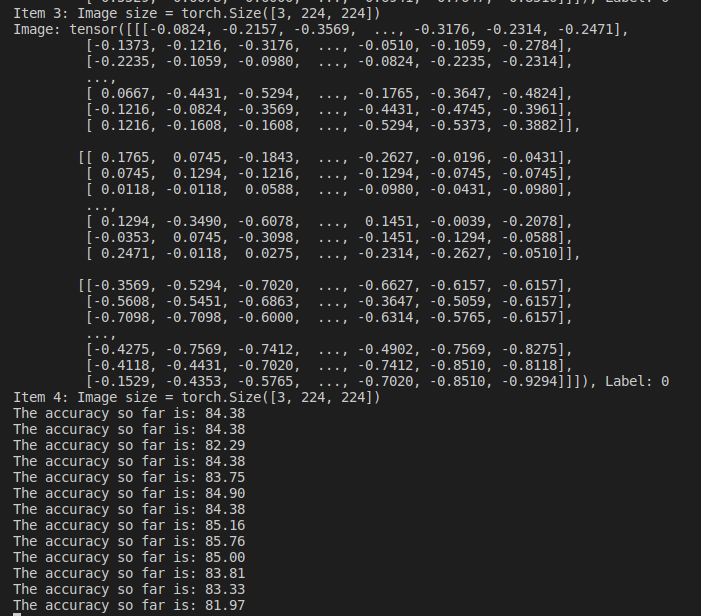
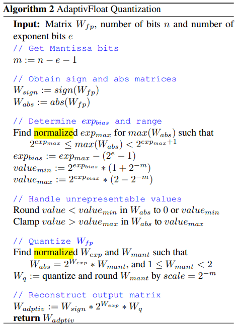

## Setting up environment:
Made changes in the code to make sure the base version ran on my machine (Can refer TejasCHANGELOG.md to check where I made changes).

## Base Model outputs:

# Chosen Task: TASK 1 - Quantization

## AdaptivFloat implementation:

1. Studied the Quantization Arithmetic article to learn the background knowledge (quantization arithmetic) for quantization in neural networks.

2. Studied the AdaptivFloat datatype paper and the algorithm used for AdaptivFloat Quantization.

3. Code: {please refer try_quant.py file for this}
- Tried implementing code for incorporating AdaptivFloat into existing codebase.
- Considered all functions in the codebase that would need to be modified (so far) for this. Possible modifications needed in following functions:
 - _quant_op()
 - forward_hook_quant_encode()
 - _uint32_to_uint8() : maybe dropping the function entirely might be needed.
 - _intmap_encode() : unsure of what this function is doing
- Wrote new functions for implementing the AdaptivFloat Quantization algorithm. Made the following progress:
 - get_exp_max() : computes the exp_max in AdaptivFloat Quant Algorithm - assumptions: input_data is floating point weights matrix
 - get_exp_bias() : computes the exp_bias, val_min and val_max (more on all below) {w_sign computed for use possibly later on} - assumptions: input_data is floating point weights matrix
- No modifications needed possibly in following functions:
 - clamp_banner2019_laplace()
 - clamp_banner2019_gelu()
 - _clamp_factor_laplace()
 - _clamp_factor_gelu()
 - tensor_encode_outerdim()

## Explanations:
1. exp_bias : is analogous to the scaling factor used in integer quantization.
2. val_min : minimum values matrix the AdaptivFloat number can take post-quantization
3. val_max : maximum values matrix the AdaptivFloat number can take post-quantization

